<html>
    <head>
        <body>
            <link rel="stylesheet" href="/style.css">
            <h1>Welcome to</h1>
 

  
<a href="#" target="_blank">Visit</a>

I have made this project with an intention to understand more about the backend and how the functions we add work
as well as to get an extra understanding of how the data gets stored on a DataBase and also to get a brief idea how we can store such data 
with an ease of few functions

Also made use of AWS S3 Bucket to store the upload image attribute

 
<h1>Tech Stack</h1>
 
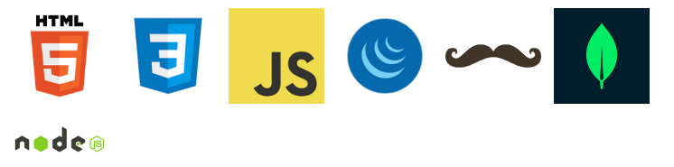 
 
<h>API's used</h>
<li>Google Places</li>
<li>Facebook Login</li> 
<h>I have made a simple login and one login using FB using <b>Passport Module</b>
For server i have used <b>express</b> and <b>node</b> for some functions
Made use of <b>mongoose</b> to create schema using <b>js</b>
Have made use of <b>Handlebars</b> as a view engine</h>

<h1 class="center">Overview</h1>

<h1>Home Page</h1>
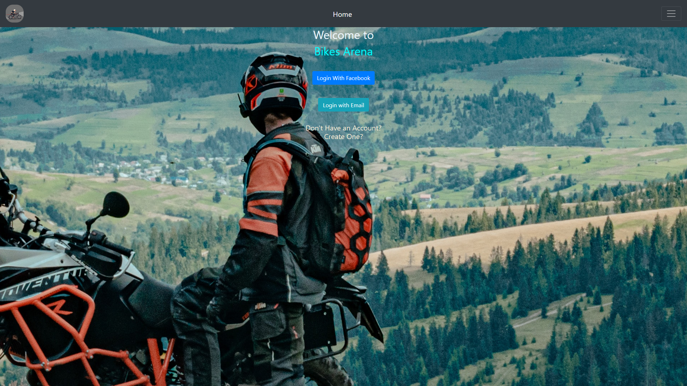
<h1>Register</h1>
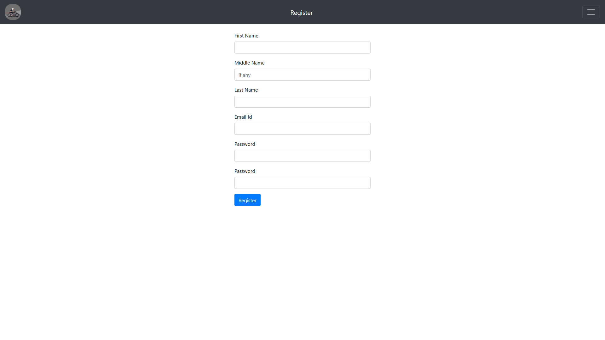
<h1>Login</h1>
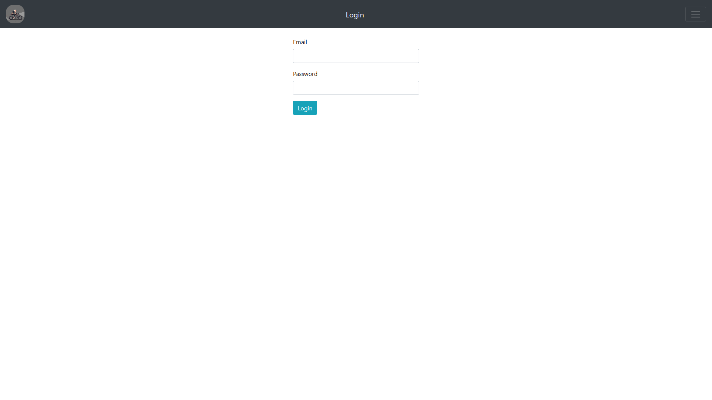
<h1>About</h1>
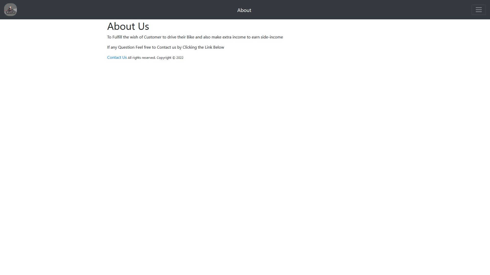
<h1>Profile</h1>
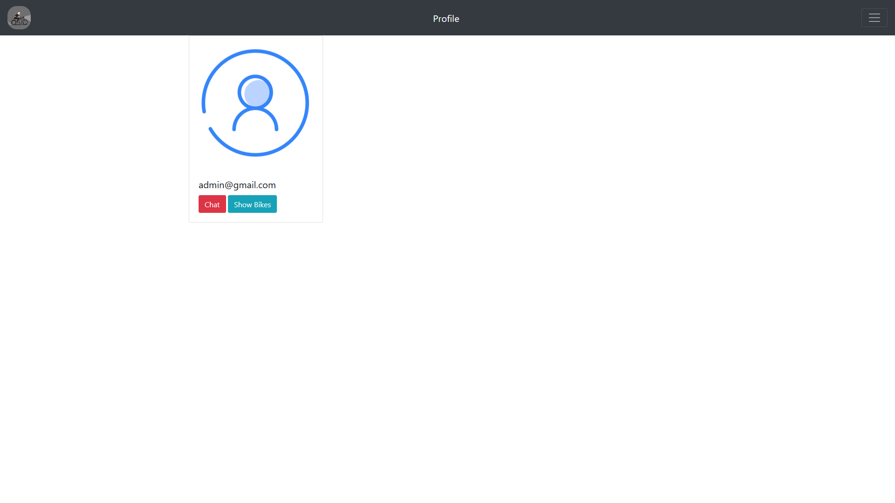
<h1>Navbar</h1>
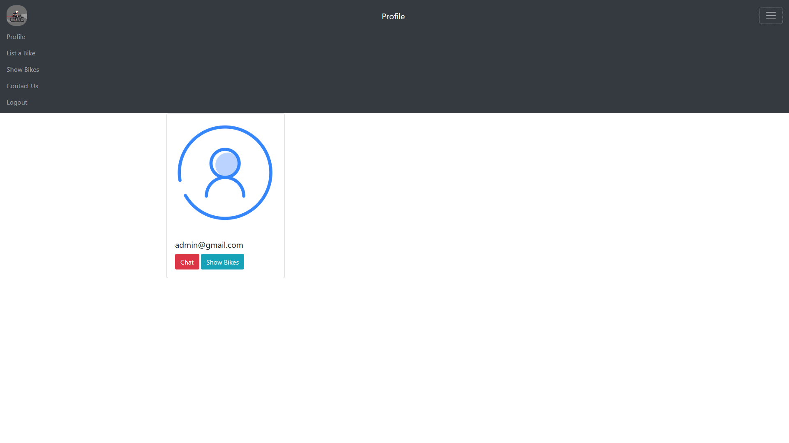
<h1>Contact us</h1>
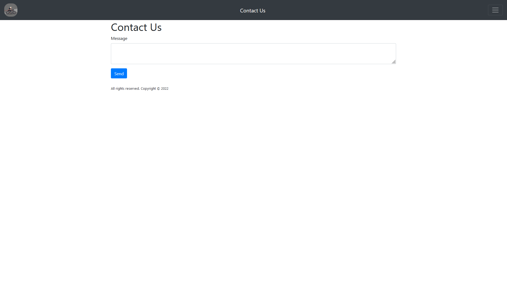
<h1>Show Bikes</h1>

<h1>List A Bike</h1>
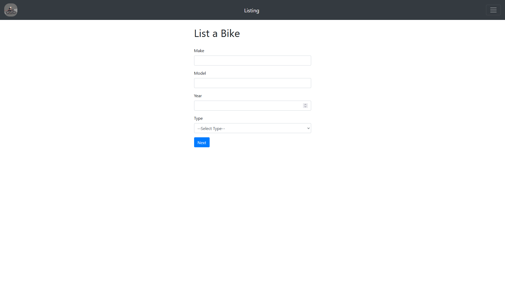
<h1>List Bike 2</h1>

<h1>Rental Details</h1>
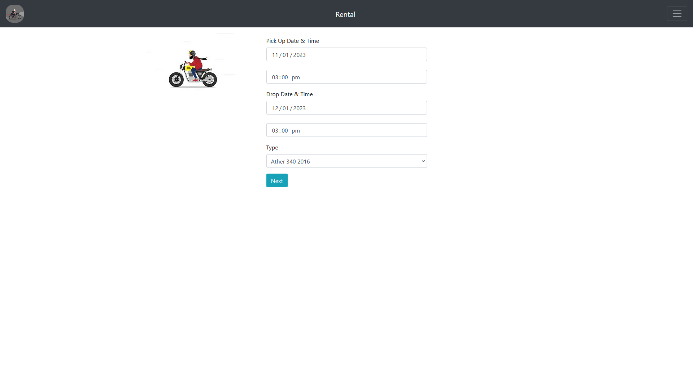
<h1>Payment Info</h1>
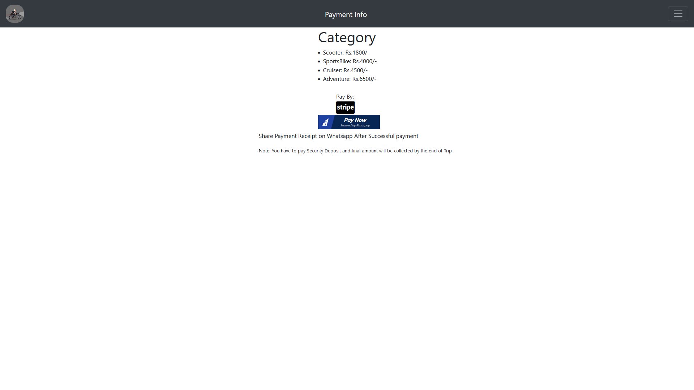
<h1>Stripe</h1>
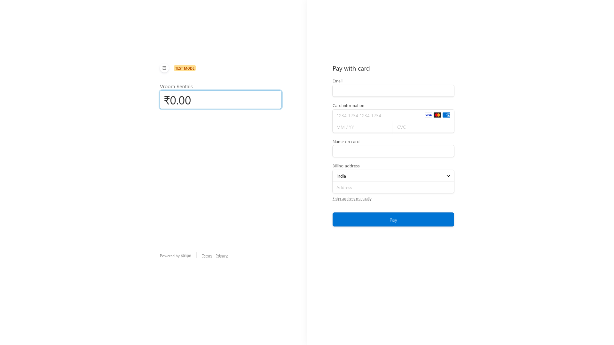
<h1>RazorPay</h1>
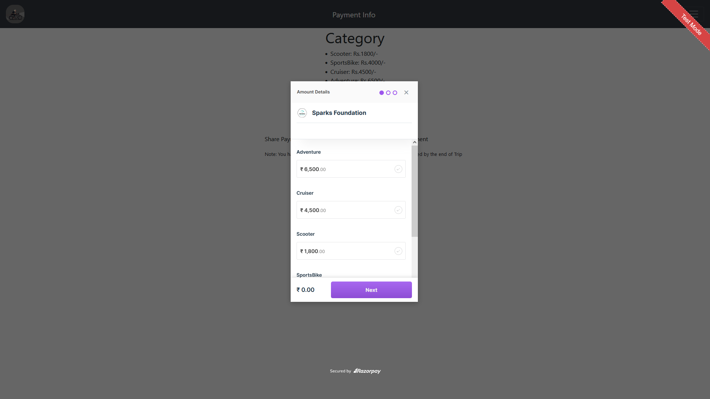
  
 
<h1>How to Run:</h1>
<li>Setup MongoDB Atlas Connection</li>
<li>npm install</li>
<li>npx nodemon app.js</li>
 

</body>
</head>
</html>
</html>
